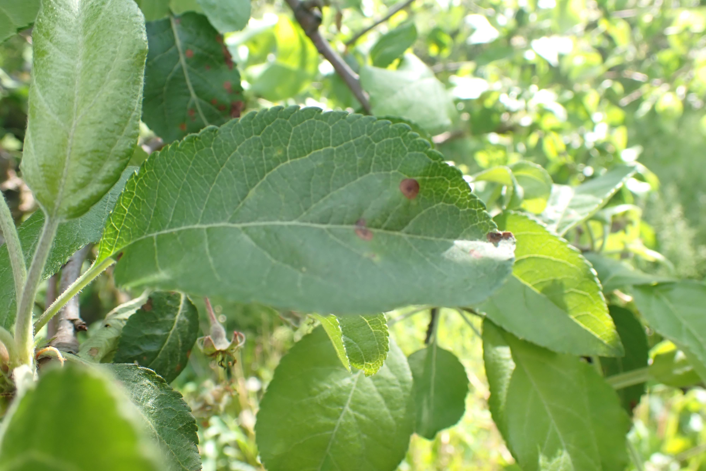
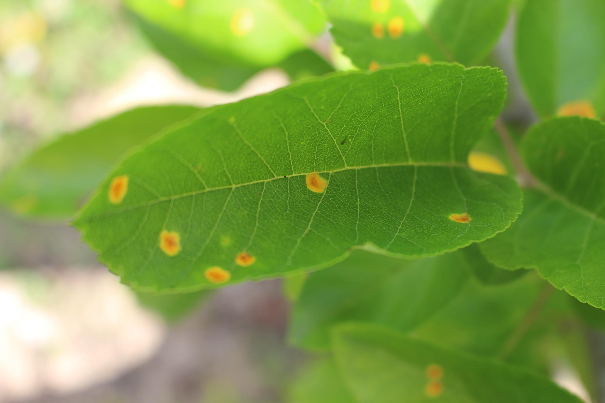
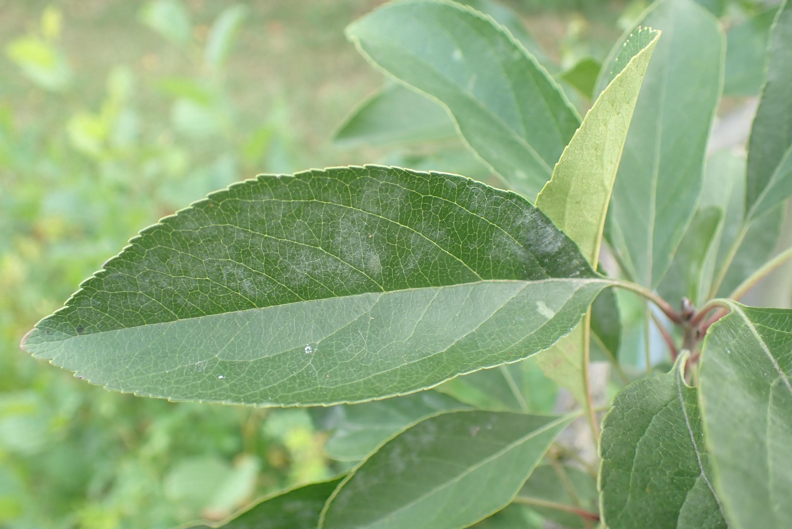
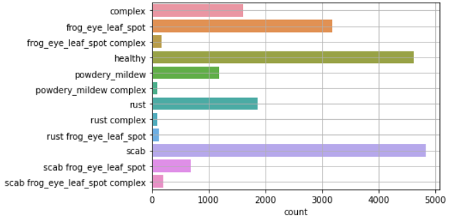
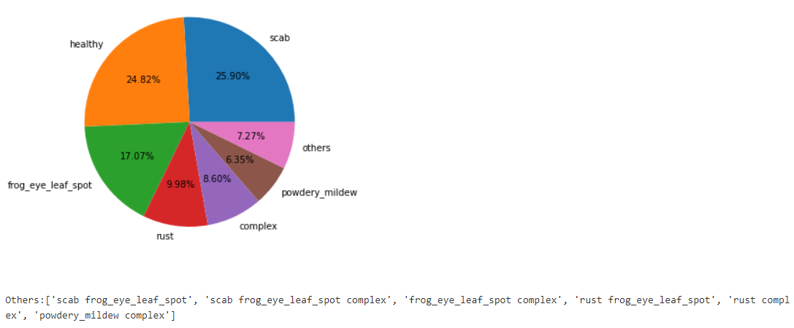
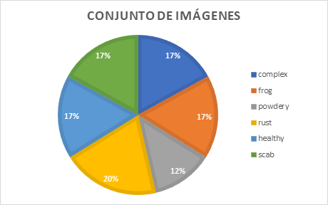
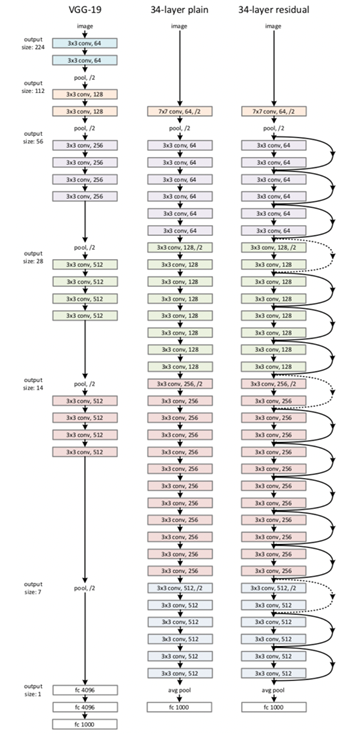
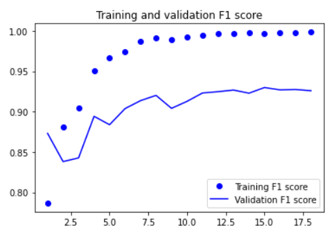
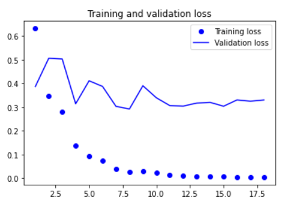
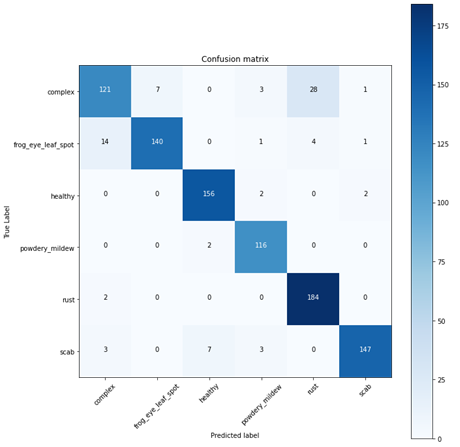

This project has been developed by the following final year students of the Mechanical Eectrical engineering career at Piura University in Peru.

* [Fiestas Cobeñas Fabio Leandro](https://www.linkedin.com/in/fabio-fiestas/ "Fiestas Cobeñas Fabio Leandro")
* [Lizana Yarleque Alexander Abelardo](https://www.linkedin.com/in/alexander-abelardo-lizana-yarleque-278550194/ "Lizana Yarleque Alexander Abelardo")
* [Tesen Bardales Cesar Aaron](https://www.linkedin.com/in/c%C3%A9sar-aar%C3%B3n-tes%C3%A9n-bardales-325280174/ "Tesen Bardales Cesar Aaron")
* [Santisteban Melendez Rodrigo Francisco](https://www.linkedin.com/in/rodrigo-santisteban-890571a5/ "Santisteban Melendez Rodrigo Francisco")

# (I) Abstract

# (II) Dataset used
Due to the limitations in the current context due to the COVID-19 pandemic, there is a complicated situation in data collection. Therefore, the Plant Pathology 2021 - FGVC82 dataset will be used. This dataset contains more of 18000 images with apple leaves affected by various diseases and a CSV (Comma Separated Values) format file, which contains the name of each images and its respective label.
We would like to emphasize that, for the simplification of this work, we only want to use the images of healthy leaves, leaves affected by a single type of disease and leaves affected with multiple diseases, but only of a specific label, then the dataset is reduced to around 17000 images
The dataset is available in the following link:

 * https://www.kaggle.com/c/plant-pathology-2021-fgvc8/data?select=train.csv

The classes used for this project are:
* Healthy
* Scab
* Powdery Mildew
* Complex
* Rust
* Frog Eye Leaf Spot

Complex:

Frog Eye Leaf Spot:

Healthy

Rust:

Scab:

Powdery Mildew:

# (III) Exploratory Data Analysis (EDA)
When you are starting a machine learning (ML) project, the most important thing to keep in mind is that data is the fundamental basis of everything. Andrew Ng, former Baidu chief science officer and founding leader of the Google Brain team, said in an interview with Wired magazine: “*The analogy with deep learning [one of the key processes in creating artificial intelligence] is that the rocket engine they are deep learning models and the fuel is the huge amounts of data that we can feed to these algorithms.* ”

We can see the number of images of each class in the data set in the following figure:

To get an overview of the data we can see the next figure:

As we see in the image avobe, we have imbalanced classes, one practical solution is to get smaller samples of the dataset then proportions are closer. Then, final proportion of classes are in the following figure:

# (IV) Image Processing
There are many techniques to process images, like Otsu, Canny Edge detector, Roi and Edge ROI image. In this project for the images processing, the processing granted by the Keras tensorflow library has been used, which offers us the possibility of processing the images with the same processing with which the Mobilenet architecture was trained. What the preprocessing does is scale the image pixels to values between -1 and 1 and returns a float32 type tensor. Also, the image size has been scaled to 224 x 224 pixels as this is the image size that MobileNet has trained with.

# (V) MobileNet Architecture
MobileNet features an architecture consisting of depth separable convolutions to make the network deep, yet lightweight.

The MobileNet architecture is imported through the Keras applications API. It has been imported with the following arguments:

|  Argument | Value |
| :------------: | :------------: |
|  Input shape |  224x224 |
| Include top |  False |
|  Weights |  Imagenet |

The input size is chosen according to the size of the images with which the model will be trained, since in the image processing the images have been scaled to 224x224, this size is chosen. In include top, False is placed because the last layers are going to be added in the final model, since MobileNet has been trained to classify 1000 classes and our image set only needs to classify 6 classes. The weights have been selected from the pre-trained model, from the Imagenet dataset.

# (VI) Building Model
The final model contains the MobileNet architecture, in addition two layers are added: GlobalAveragePooling2D and a Dense layer of 6 units.
The model will have all the trainable layers, the number of total, trainable and non-trainable parameters will be the following:

|  Argument | Value |
| :------------: | :------------: |
|Total parameters| 3,235,014|
|Trainable parameters |3,213,126|
|Non-trainable parameters |21,888|

# (VII) Results
The model started with a good performance, with initial values of F1 score of 0.7868 for training and 0.8731 for validation. The training stopped after 18 epochs because the validation loss stopped decreasing (the EarlyStopping object was activated). The curves for training and validation can be seen in the following figure:

The model is evaluated with the *evaluate* method and the following results are obtained:

|   | Loss  | F1 score  |
| :------------: | :------------: | :------------: |
|  Training | 0.0085  |  0.998  |
| Validation  |  0.2911 | 0.9206  |
| Test  |  0.3382 | 0.9157  |

# (VIII) Confusion Matrix
The confusion matrix has been plotted for the results of the prediction of the test set, the following figure shows the confusion matrix:

A summary table of true positives and false positives is displayed:

|   | Number of samples  | TP  |  FP |  Accuracy |
| :------------: | :------------: | :------------: | :------------: | :------------: |
| Complex  | 140  | 121  | 19  | 86.4  |
| Frog eye leaf spot  | 147  | 140  | 7  | 95.2  |
|  healthy | 165  | 156  | 9  | 94.5  |
| powdery mildew  | 125  | 116  | 9  | 92.8  |
|  rust | 216  | 184  | 32  | 85.2  |
| scab  | 151  | 147  | 4  | 97.4  |

References:
* https://github.com/CodingWitcher/Leaf_Diseases
* https://deeplizard.com/learn/video/Zrt76AIbeh4
